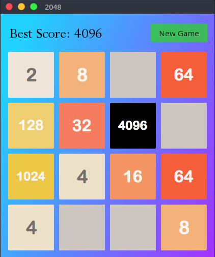
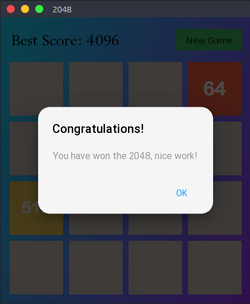
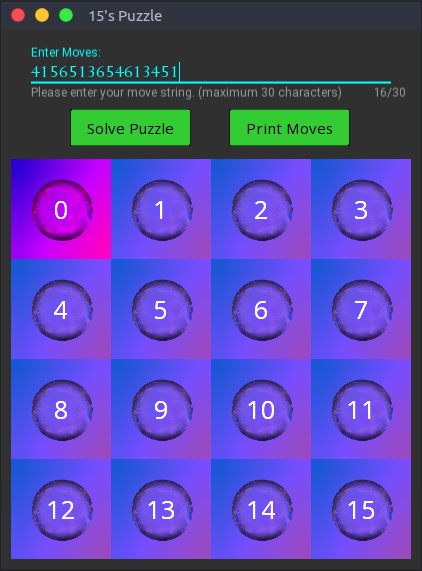
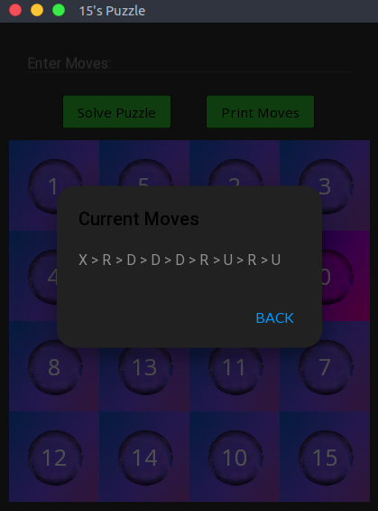

# GameStore

Draft implementations of some classic simple games in Python.

Games in this repo are borrowed from the [Fundamentals of Computing Specialization](https://www.coursera.org/specializations/computer-fundamentals) offered by Rice University on Coursera, which were originally built on `codeskulptor` when I was taking the courses several years ago, located in the `simplegui` folder. I have added some customized functionalities and migrated them to [kivy](https://kivy.org/#home) so that the user interfaces look prettier with material design and animation effects.

It might be a nice attempt to deploy kivy apps online and render them in a web browser, but currently this is not feasible. While it's not impossible to do so, the amount of technical work required is anything but a non-trivial task, using web applications framework instead would be a way better option.


## Game list

> As a benchmark measure of **implementation complexity**, I have rated each game with stars, this is after all my personal sense so by no means objective. Code complexity is not the same as game difficulty, but an indicator of development workload and how hard it is to build the user interface. For instance, the strategy to build a **15 puzzle** solver is hard, but the UI development is trivial, the UI of **Asteroids** looks fancy, but all objects are moving asynchronously so it's easy to implement as well. In contrast, **Memory** looks simple at first glance, but it turns out to be quite hard to code, there are many corner cases that could lead to bugs, some events need to block and wait, and it's not easy to handle concurrency as appropriate (animation coroutines, popup window time delays, unexpected mouse/keyboard events, etc), especially because kivy does not work well with `sleep`, `thread`, `async` and `await`.

- [x] Game demos available on [Youtube](www.google.com).

- [2048](#2048)
- [Asteroids](#asteroids)
- [Memory](#memory)
- [Pong](#pong)
- [15 puzzle](#15-puzzle)
- [Blackjack](#blackjack)
- [Stopwatch](#stopwatch)

<br/>

## 2048 ★★★★☆

Win the game by making a 2048 tile.

__Game Logic:__ Use the 4 direction arrow keys to slide the tiles on the board. When the tiles slide, adjacent tiles with the same number will be merged into a number that is doubled, and a new tile will appear in a randomly selected empty cell. The new tile is 2 90% of the time and 4 10% of the time. If there are no more empty cells and no legal merges can be made, the board is deadlocked so the user loses. The best score is the largest tile ever made on the board.


in play                   | win
:------------------------:|:------------------------:
 |  

<br/>

## Asteroids ★★★★☆

A space-themed multi-directional shooter arcade game.

__Game Logic:__ A shooter game simply does not need any logic, but to make it more playable, I have modified the original version into a flavor that feels more like Raiden III. The player starts the game from a login screen, and can later pause the game to switch back and forth between screens.

<p align="center">
  
</p>


In the main screen, the player controls a raider with mouse drags or finger touches, shoots cannons using the space bar to destroy enemies and gain points. There are various types of enemies, heavy meteorite and star object falls down at a steeper angle, slow but hard to destroy (high HP), UFOs and missiles make fast and aggressive moves so are very dangerous, but relatively vulnerable given their low HP.  It is possible to pause the game by pressing enter key, open up a timer setter popup window, or press enter again to resume.


<p align="center">
  
</p>


Event handlers are scheduled at high FPS to process group collisions in real-time, when an enemy's HP reaches 0, it explodes on the spot with 90% chance, or becomes a bonus widget bouncing off the window. If the raider catches the bonus, additional scores are earned, and the raider is protected by a light shield. There's nothing fancy going on here, explosion effects are created by manipulating widget opacity coupled with a scheduled timeout event, meteorite rotations are achieved by updating the angle of a rotation graphics instruction. The only challenge of this game is about memory management. To prevent memory overload, a garbage collection function must be explicitly defined and registered, which serves to check boundaries, collisions, and remove dead sprites from the widget tree on a regular basis. These objects won't be automatically garbage collected until the references are cleared from the screen canvas.

Game assets are collected from the web with free permission, raider image asset courtesy of [dravenx](https://opengameart.org/users/dravenx).

<br/>

## Memory ★★★★★

A nice matching game that tests your short-term memory.

__Game Logic:__ The objective of this game is to match all cards on the board. The board has 36 cells, comprised of 18 pairs of cards, face down in random order. The player turns over two cards at a time, with the goal of turning over a matching pair, by using his memory. A matched pair will stay visible on board, a mismatched pair will be turned back 0.5 seconds after they are turned over. Here I'm using images of weapons from the [CSGO](https://store.steampowered.com/app/730/CounterStrike_Global_Offensive/) inventory to simulate case opening, for fun. Of course, there's no way I could afford these rare items with real $dollars.

<p align="center">
  
</p>


The complexity of this game mainly comes from concurrency issues, most of which stem from the animation effects (also the popup dialog window). The key functions are coded as described below, but there are many corner cases in the caller elsewhere. In brief, card animation is achieved by animating the image texture opacity, first from 1 to 0, then change texture (flip the card), then from 0 to 1, so as to visually create a fade effect. Without animation effects, it would be a lot easier to implement.

```python
# To flip a list of cards in sequence, call flip_one() one by one.
# To flip a list of cards all at once, use the concurrent version flip_all().

async def flip_one(self, card, event):
    x, y = self.card_row_col(card.pos)
    new_index = self.index[x, y] if card.index == 0 else 0
    
    # create the new card widget which is initially transparent
    flipped = Card(index=new_index, theme=self.theme,
                   pos=card.pos, size=card.size, opacity=0.5)
    self.cards[x, y] = flipped
    
    # animate the old card opacity from 1 to 0.5, wait until finish, then remove the old card widget
    await ak.animate(card, opacity=0.5, duration=0.25, transition='in_out_sine')
    self.remove_widget(card)
    
    # add the new card widget (which is transparent)
    self.add_widget(flipped)
    
    # animate the new card opacity from 0.5 to 1, wait until finish, then set it to opaque
    await ak.animate(flipped, opacity=1, duration=0.25, transition='in_out_sine')
    self.cards[x, y].opacity = 1
    
    event.set()  # animation complete, notify the caller who is waiting for the event

async def flip_all(self, cards, event):
    child_events = []
    
    for card in cards:  # start asynchronous calls
        child_event = ak.Event()  # each card has a child event to avoid race conditions
        child_events.append(child_event)
        ak.start(self.flip_one(card, child_event))
    
    for child_event in child_events:
        await child_event.wait()  # wait until all events join

    event.set()  # all animations complete, notify the caller who is waiting for the event
```

Given that every call in kivy is asynchronous, execution does not wait for animations to finish but will continue immediately, leaving a vulnerable time window when many things could go awry due to race conditions. Besides, a mismatched pair of cards need to stay visible on board (sleep) for a while before they are turned back, so that players can have enough time to remember them. To handle these issues properly, my implementation uses `asynckivy` which is a new module recently released in July 2020.

<details>
<summary>Detailed specifications</summary>

- Make a 6x6 board with some cute icons (36/2 = 18 icons)
- Create a button above the board that selects the theme, each features a different set of 18 icons
- When the button is clicked, pop up a dropdown list or alike that lets the user choose a theme
- Add another button that restarts the game without changing the theme
- Choose a back side image for all themes, laid over by a border image

- Add animation effects when the card is flipped on the board
- If the second card flipped does not match, let them stay onboard for 2 seconds before flipping back
- When a click is being handled, disable mouse clicks until the handler returns

- Keep track of time elapsed in seconds in a text label
- Keep track of total number of flips that have been made
- Keep track of the best record (shortest time) the player has achieved
- If all cards are matched, the user wins, pop up a dialog window saying congrats and display score (time)
</details>

<details>
<summary>Implementation caveats</summary>

- Window size and card size must be dynamically adjusted for themes with different aspect ratios
- Refrain from using `time.sleep()`, this will block the main event loop and freeze the window
- To schedule an event, use `Clock.schedule_interval()` together with a callback function
- The scheduled event will be automatically unscheduled as soon as the callback returns False
- Typically, callbacks do not accept extra arguments since they are referenced only by names
- To work with additional arguments, wrap it with a partial function when you bind to it
- Everything including scheduled events are asynchronous so that concurrency could be tricky

- Test carefully with logging messages to eliminate any possible race conditions (e.g. fast mouse clicks)
- There's no way to make a call equivalent to `time.sleep()` in kivy, other modules are required
- To implement custom concurrency behaviors, use the newly released `asynckivy` module
- Keep in mind that the `asyncio`, `threading` and `subprocess` may not work properly in kivy
</details>

<br/>

## Pong ★★★☆☆

A classic arcade game that simulates table tennis.

__Game Logic:__ A ball spawns from the center of the window, moves at an initial speed in a random direction. The ball bounces off the top and bottom of the screen as well as the left and right player paddles. The player can move a paddle by dragging the mouse in the border area to hit the ball, or lose a point if the ball flies out of bound. The ball speeds up each time it collides with the paddle, paddle becomes shorter each time the player loses a round.

<p align="center">
  
</p>


<br/>

## 15 puzzle ★★★★☆

A sliding puzzle that consists of a frame of numbered square tiles in random order with one tile missing. [[wiki]](https://en.wikipedia.org/wiki/15_puzzle)

__Game Logic:__ The 4x4 board contains 15 numbers from 1 to 15 and an empty tile. For convenience, the empty tile here is represented by the number 0. Given a random configuration of the board, make a sequence of moves by sliding the 0 tile to exchange position with numbers nearby, so as to move the board back to the solved configuration. (where numbers 0 to 15 are placed in order on the grid)

On the top of the window is an _on-focus_ text field where the user can input a move string, it includes valid characters `u:up d:down l:left r:right` and must not exceed 30 characters. When the user presses enter, numbers on the board will move according to the string. The user can also just use the keyboard arrow keys to move the 0 tile, or click the button to see the current moves that have been made.

For any chaotic configuration, clicking the "solve puzzle" button enters the solving mode, the board will start to show the moves step by step to return to the solved state. Before this stage finishes, keyboard is disabled so that no key events will be triggered, any content typed into the text input field will simply be discarded.

To make a slack UI design, the window is drawn in dark mode, and the board canvas uses a CSS light gradient background. On top of that, each tile superimposes a rectangle graphic instruction to increase the hue, draws the label number and applies a CSS style border image using a transparent crystal ball image. Below are the screenshots.

|   enter a move string    | print moves (dark mode)  |
| :----------------------: | :----------------------: |
|  |  |

<br/>

## Blackjack ★★★☆☆

A simplified version of the most widely played casino banking game [Blackjack](https://en.wikipedia.org/wiki/Blackjack).

__Game Logic:__ Basically this is a comparing card game between the player and the dealer. On start, the dealer is dealt two cards, one up (exposed) and one down (hidden). The player is also dealt two cards, face up. The player has the option to draw new cards from the deck (hit), or complete his hand without drawing new cards (stand). Then the dealer exposes his hidden card, repeatedly draw new cards until his hand has value > 17. Finally, their hand values are compared to each other, the player wins if and only if his hand value is strictly greater than the dealer's and he did not bust. If the player busted (has a hand value that exceeds 21), he always loses the game even if the dealer has also busted.

The value of a card depends on the rank rather than the suit. A number card has value equal to the number, a face card (K, Q, J) has value 10. Ace card is worth either 1 or 11 (of the player's choice). A hand's value is the sum of the card values. This game uses the minimalist playing card assets pack courtesy of [Lokesh Mehra](https://opengameart.org/users/mehrasaur). To facilitate card image cropping, I have concatenated all cards into a sprite sheet without borders, one row for each suit, one column for each rank, using `convert` on the command line.

```bash
$ convert 1.png 2.png 3.png ... +append out.png  # merge horizontally
$ convert 1.png 2.png 3.png ... -append out.png  # merge vertically
```

As a simplified version, this implementation does not incorporate any rules of play at real casinos, no double, no splits, no hole card. The most basic strategy is to reference a cheat sheet that every gambler in Las Vegas has.

<p align="center">
  
</p>


<br/>

## Stopwatch ★★☆☆☆

A clicker game, somewhat resembles a casino slot machine?

__Game Logic:__ The window as a vertical box layout contains three rows: a clock showing the current time (in CPU clock), two buttons which are self-explanatory, and a stopwatch along with the score (wins / total rounds). When the user clicks "start", the button text changes to "stop", and the stopwatch starts to run, if the stopwatch stops when the last red digit (tenth of a second) is exactly 0, the user wins the round.

<p align="center">
  
</p>

<br/>

## To be continued...

......

<br/>


# Reference

- [Fundamentals of Computing Specialization](https://www.coursera.org/specializations/computer-fundamentals), Rice, Coursera
- Kivy framework API - https://kivy.org/doc/stable/api-kivy.html
- KivyMD documentation - https://kivymd.readthedocs.io/en/latest/index.html
- free image assets: https://www.goodfon.com/
- free transparent PNGs - https://www.stickpng.com/
