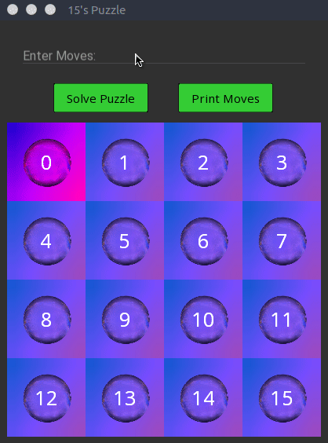

# GameStore

Draft implementations of some classic simple games in Python.

Most of the game logic is borrowed from the [Fundamentals of Computing Specialization](https://www.coursera.org/specializations/computer-fundamentals) offered by Rice University on Coursera, which were originally built on `codeskulptor` and `simplegui` when I was taking the courses several years ago. I have added some customized functionalities and migrated them to [kivy](https://kivy.org/#home) so that the user interfaces look prettier with material design and animation effects.

Kivy is a nice library for building cross-platform GUIs in Python especially when it comes to mobile applications, it's still being actively developed, but I personally do not like how it works, mostly due to its bizarre, counter-intuitive behaviors, horrible documentation and the lack of users & community support. The motivation of separating logic and interface design is nice, but for small desktop applications I think it's just making lives harder... It feels much better than the old-school Java Swing/AWT, but still far from perfect, hope it would improve in the future... _Write once, run away._

## Stopwatch

A clicker game, somewhat resembles a casino slot machine?

__Game Logic:__

The window as a vertical box layout contains three rows: a clock showing the current time (in CPU clock), two buttons which are self-explanatory, and a stopwatch along with the score (wins / total rounds). When the user clicks "start", the button text changes to "stop", and the stopwatch starts to run, if the stopwatch stops when the last red digit (tenth of a second) is exactly 0, the user wins the round.

  

## Pong

A classic arcade game that simulates table tennis.

__Game Logic:__

A ball spawns from the center of the window, moves at an initial speed in a random direction. The ball bounces off the top and bottom of the screen as well as the left and right player paddles. The player can move a paddle by dragging the mouse in the border area to hit the ball, or lose a point if the ball flies out of bound. The ball speeds up each time it collides with the paddle, paddle becomes shorter each time the player loses a round.

  

## 2048

Win the game by making a 2048 tile.

__Game Logic:__

Use the up, down, left and right arrow keys to slide the tiles on the board. When the tiles slide, adjacent tiles with the same number will be merged into a number that is doubled, and a new tile will appear in a randomly selected empty cell. The new tile is 2 90% of the time and 4 10% of the time. If there are no more empty cells and no legal merges can be made, the board is deadlocked so the user loses. The best score is the largest tile ever made on the board.

in play                   | win
:------------------------:|:------------------------:
 | 

## 15 puzzle

A sliding puzzle that consists of a frame of numbered square tiles in random order with one tile missing. [[wiki]](https://en.wikipedia.org/wiki/15_puzzle)

__Game Logic:__

The 4x4 board contains 15 numbers from 1 to 15 and an empty tile. For convenience, the empty tile here is represented by the number 0. Given a random configuration of the board, make a sequence of moves by sliding the 0 tile to exchange position with numbers nearby, so as to move the board back to the solved configuration. (where numbers 0 to 15 are placed in order on the grid)

On the top of the window is an _on-focus_ text field where the user can input a move string, it includes valid characters `u:up d:down l:left r:right` and must not exceed 30 characters. When the user presses enter, numbers on the board will move according to the string. The user can also just use the keyboard arrow keys to move the 0 tile, or click the button to see the current moves that have been made.

For any chaotic configuration, clicking the "solve puzzle" button enters the solving mode, the board will start to show the moves step by step to return to the solved state. Before this stage finishes, keyboard is disabled so that no key events will be triggered, any content typed into the text input field will simply be discarded.

To make a slack UI design, the window is drawn in dark mode, and the board canvas uses a CSS light gradient background. On top of that, each tile superimposes a rectangle graphic instruction to increase the hue, draws the label number and applies a CSS style border image using a transparent crystal ball image. Below are the screenshots.

__P.S.__ I guess Github has a limit on frame rate ~ 20 fps so the GIF is not rendered at the original speed (60 fps).

|      enter a move string      |     move string too long      |
| :---------------------------: | :---------------------------: |
|  |  |

|      print moves (dark mode)      |     a simple demo             |
| :---------------------------: | :---------------------------: |
|  |  |

## Memory

A nice game that tests your short-term memory.

__Game Logic:__

...

# Reference

- [Fundamentals of Computing Specialization](https://www.coursera.org/specializations/computer-fundamentals), Rice, Coursera
- Kivy framework API - https://kivy.org/doc/stable/api-kivy.html
- KivyMD documentation - https://kivymd.readthedocs.io/en/latest/index.html
- free image assets: https://www.goodfon.com/
- free transparent PNGs - https://www.stickpng.com/
